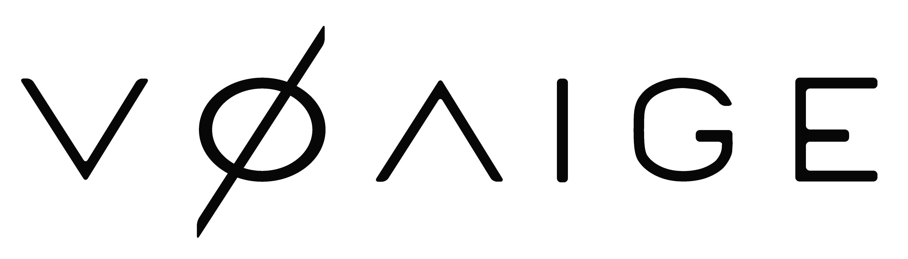

<h1>About Me</h1>
More info on my background and experience is listed here.

On this page:  
- Education
- Work Experience
- Research
- Resume

<h1>Education</h1>

<!--

	

		
	

	

		
	

-->

  
  
  

I graduated with a B.S. in Mechanical Engineering (with a Specialization in Controls and Robotics) from The University of California, San Diego in June 2020. 

I graduated from the MRSD (Master of Science in Robotic Systems Development) program at Carnegie Mellon University (School of Computer Science) in May 2022.

Click [here](https://mrsdprojects.ri.cmu.edu/2021teamd/) for information on my MRSD project: Mobile Robot Image/Object Classification and Avoidance.

<h1>Work Experience</h1>

My work experience so far has consisted of various internships, either in Robotics or Engineering. Details for each internship are listed below (most recent first).

<!--  -->

From February 2021 to May 2022, I worked part time at [Voaige](https://www.voaige.com/), which is a new robotics startup spun out of Carnegie Mellon University. As one of the early team members, my main work was integrating our code and software with all the physical robot arms we deploy on (arm models and requirements vary based on client/contract/etc.). This mainly involved work with ROS, MoveIt, and Rviz, along with each arm's custom proprietary software tools.

In Summer 2021, I interned at [BotBuilt](https://www.linkedin.com/company/botbuilt/about/), a recent robotics startup from Y Combinator based in North Carolina. BotBuilt uses robot arms for housing construction (e.g. to construct critical housing components like wall panels and floor trusses); as a Robotics Intern, my role included equal parts hardware and software while working with the robot arms. On the hardware side, I designed and tested a pneumatics-based mechanical clamping assembly, which would be used to hold components in place while the robot arm finishes assembling them. On the software side, I implemented scripts (ROS2, C++) for behavior planning of the robot, so that it could handle construction of arbitrarily-dimensioned wall panels and appropriately switch end-effectors during assembly as necessary.

In Summer 2019, I interned at [ASML](https://www.asml.com/en) as a Systems Integration Intern. There, I used Python, HTML, and TIBCO Spotfire to develop data analytics and visualization dashboards, which are used during daily team meetings to quickly gauge system performance and productivity. I also developed a semi-autonomous key performance indicator (KPI) notification and tracking tool, which is used by company managers to quickly respond to any performance risks. 

In Summer 2018, I interned at [Solar Turbines](https://www.solarturbines.com/) as a Packaging and Systems Intern. There, I used VBA to develop an autonomous Excel Tool that autonomously calculates the optimal configurations of package lift kits, which are used during the transportation and assembly process of turbines. This tool has led to annual savings of approximately $50,000 USD for the company, thanks to saved material costs and engineering hours.

<h3>Other Work</h3>

<ul>
	<li>Teaching Assistant at Carnegie Mellon University, Fall 2021</li>
	<ul>
		<li>Course: Robot Mobility (Robotics Institute, Graduate-level)</li>
		<li>Supported the Robot Mobility course, which covers fundamentals of wheeled, aerial, legged, and underwater mobility for robotics</li>
		<li>Held weekly office hours, graded reports, provided guidance for assignments, etc.</li>
	</ul>
</ul>

<ul>
	<li>Engineering Tutor at University of California, San Diego, Fall 2018</li>
	<ul>
		<li>Course: Introduction to Engineering Graphics and Design (Jacobs School of Engineering)</li>
		<li>Hosted weekly sessions of an undergraduate introductory robotics class</li>
		<li>Clarified key theoretical concepts, taught CAD/CAM skills, oversaw student design studio</li>
		<li>Facilitated and graded assignments (engineering drawings, formal reports, etc.)</li>
	</ul>
</ul>

<h1>Research</h1>

From 2019 to 2021 I worked at the [Bioinspired Robotics and Design Lab](https://sites.google.com/eng.ucsd.edu/bioinspired/home) at The University of California, San Diego. While there, I assisted in the development of bioinspired gripping pads and fluidic elastomer actuators through force and material testing, physical prototype manufacture, and virtual prototype simulation using SOFA (Simulation Open Framework Architecture).  

The paper corresponding to this work:  
>Sandoval J.A., **Xu T.**, Adibnazari I., Deheyn D. D., Tolley M. T., "Combining suction and friction to stabilize a soft gripper to shear and
normal forces, for manipulation of soft objects in wet environments". IEEE Robotics and Automation Letters. Manuscript submitted for review.

<h1>Resume/CV</h1>
Click [here](https://drive.google.com/file/d/1QCU4agZeN6Dy4QsbanTNfE6jMK4iwK9J/view?usp=sharing) for a copy of my current resume.
Please feel free to contact me at thomas.w.xu@gmail.com with any inquiries.

Click [here](/) to go back to the main page.