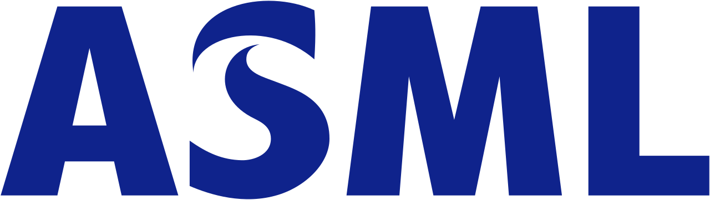

<h1>About Me</h1>

<h3>Education</h3>

I graduated with a B.S. in Mechanical Engineering (with a Specialization in Controls and Robotics) from The University of California, San Diego in Spring 2020. I'm currently enrolled in the MRSD (Master of Science in Robotic Systems Development) program at Carnegie Mellon University; my expected graduation date is May 2022.

Click [here](https://mrsdprojects.ri.cmu.edu/2021teamd/) for information on my MRSD project: Mobile Robot Image/Object Classification and Avoidance.

<h3>Work Experience</h3>

I have completed two previous industry internships:
In Summer 2019, I interned at ASML as a Systems Integration Intern. There, I used Python, HTML, and TIBCO Spotfire to develop data analytics and visualization dashboards, which are used during team meetings to quickly gauge system performance and productivity.
In Summer 2018, I interned at Solar Turbines as a Packaging and Systems Intern. There, I used VBA to develop an autonomous Excel Tool that autonomously calculates the optimal configurations of package lift kits, which are used during the transportation and assembly process of turbines.
Since 2019 I've also worked at the Bioinspired Robotics and Design Lab at The University of California, San Diego, where I assisted in the development of bioinspired gripping pads and fluidic elastomer actuators through force and material testing, physical prototype manufacture, and virtual prototype simulation using SOFA (Simulation Open Framework Architecture). That work is currently pending publication.

<h1>Resume/CV</h1>
Click [here](https://github.com/thomaswxu/thomaswxu.github.io/blob/master/files/Thomas_W_Xu_Resume.pdf) for a copy of my current resume.

Click [here](/) to go back.